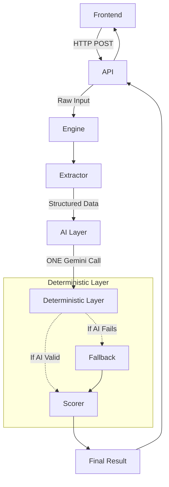

# Changes & Migration

This document describes the architectural transformation of the AI Resume Screener from its original monolithic implementation to the current modular AI + deterministic pipeline.

## Executive Summary

**OLD:**
```text
Frontend
   ↓
Large monolithic backend/main.py
   ├── file extraction
   ├── resume parsing
   ├── JD parsing
   ├── Gemini calls
   ├── matching
   ├── fallback logic
   ├── scoring
   └── API routes
```

**NEW:**
```text
Frontend
   ↓
API
   ↓
Engine
   ↓
Extractor
   ↓
AI Layer (ONE Gemini call)
   ↓
Deterministic Layer
   ↓
Final result
```

The system was transformed from a fast-prototyping monolith into a scalable, robust architecture with clear module boundaries, ensuring testability and protecting deterministic scoring from LLM hallucinations.

## Why the Refactor Was Needed

The original implementation concentrated nearly all functionality inside a single file (`backend/main.py`). While excellent for initial prototyping, this created several long-term issues:

- **Tight Coupling:** API routes were mixed directly with business logic, extraction routines, and AI logic.
- **Testing Difficulty:** Modifying the scoring logic required navigating the same file handling HTTP uploads and AI fallbacks, making isolated unit testing extremely difficult.
- **Fragile AI Integration:** Multiple disparate calls to Gemini meant more points of failure and more latency.
- **Maintenance Overhead:** Developers had to understand the entire monolith to confidently change a single feature. Replacing the Gemini implementation with another AI model would have required a massive rewrite.

## Old Architecture

The original application was centralized in `backend/main.py`.

### Responsibilities
- FastAPI application initialization and routing.
- PDF and DOCX extraction logic.
- Resume and Job Description (JD) heuristic parsing.
- Gemini API integration.
- Candidate-job semantic matching.
- Deterministic fallback handling.
- Numerical scoring.
- Response construction.

### Old Gemini Flow
The original system typically performed separate AI operations for different parts of the workflow (e.g., extracting/analyzing the resume independently from the job description and candidate matching), which resulted in multiple network hops.

### Old Scoring
The original deterministic scoring weights were:
- Required Skills = 50%
- Experience = 25%
- Education = 15%
- Preferred Skills = 10%

This weighting was inherently deterministic but was co-located with the AI and routing code.

## Old Project Pros and Cons

**Pros:**
- Simple to understand initially (everything in one place).
- Quick to prototype and easy to run locally.
- Minimal files and few module boundaries.

**Cons:**
- Poor separation of concerns (monolithic).
- Extremely difficult to unit-test independent features.
- Hard to substitute implementations (e.g., changing PDF parsers or AI models).
- Logic duplication and entanglement.

## New Architecture

The backend was broken out into specific, isolated modules:

```text
backend/
├── app.py           (FastAPI entry point)
├── api/             (HTTP endpoints & legacy compatibility adapters)
├── engine/          (Orchestrates pipeline execution)
├── extractor/       (Document extraction & heuristic parsing)
├── ai_layer/        (Gemini prompts, calls, and validation)
├── deterministic/   (Validation, fallback matching, numerical scoring)
└── observability/   (Deep CLI request tracing)
```

## New Pipeline



## Why the One-Gemini-Call Design Changed

**OLD:** Multiple independent Gemini analyses.
**NEW:** One combined structured resume + JD request.

**Advantages:**
- Drastically fewer network round trips and lower overall latency.
- Centralized semantic reasoning (the LLM evaluates everything in context).
- Easier quota and rate limit management.

**Tradeoffs:**
- Requires a larger, more complex single prompt.
- A failure in this single call affects the entire semantic analysis layer.
- *Mitigation*: The deterministic fallback completely safeguards against this single point of failure.

## AI vs Deterministic Responsibilities

**Gemini is responsible for:**
- Semantic interpretation (e.g. recognizing "Photoshop" fulfills "Adobe Photoshop").
- Experience and education assessment.
- Qualitative candidate summaries.

**Deterministic code is responsible for:**
- Validating the AI's JSON output structure.
- Fallback heuristic matching.
- Exact numerical scoring calculation.

This architectural boundary guarantees that the LLM cannot hallucinate or arbitrarily influence the final percentage score.

## Scoring: Old vs New

| Area | Old | New |
|------|-----|-----|
| Required skills | deterministic | deterministic |
| Experience | deterministic | deterministic |
| Education | deterministic | deterministic |
| Preferred skills | deterministic | deterministic |
| Final score | Python | Python |
| Gemini controls score | No | No |

*Note: The core scoring philosophy and exact mathematical weights were strictly preserved. Only the architecture changed.*

## Fallback: Old vs New

**OLD:** Gemini API logic and deterministic fallback procedures were intertwined inside the monolithic endpoint. 
**NEW:** AI failures are caught in the `ai_layer` and normalized into standard error payloads. The Engine continues seamlessly, and the `deterministic/gate.py` observes the failure and explicitly triggers the `fallback.py` heuristic matcher. The Scorer processes the result identically either way.

## API Compatibility

The internal backend architecture was rewritten entirely, but **the frontend API contract was intentionally preserved**. 
Existing endpoints (`POST /api/resumes/ai-parse`, `POST /api/jobs/parse`, `POST /api/match`, `POST /api/score`) continue to function alongside the unified `/api/analyze` pipeline. This allowed a complete backend refactor without breaking frontend compatibility or requiring simultaneous rewrites.

## Frontend Changes

The frontend components (`App.jsx`) were slightly refactored to componentize the architecture and use dedicated API service functions (`services/api.js`), but the fundamental state and UI workflow were preserved to maintain the application boundary.

## Testing Before vs After

**OLD:** Sparse testing heavily constrained by the monolith.
**NEW:** 35 passing automated tests across a comprehensive suite covering:
- Extraction engines (PyMuPDF & python-docx)
- Semantic AI prompts and the one-call invariant
- AI timeout/failure simulations
- Deterministic heuristic fallbacks
- Scoring accuracy
- Full API pipeline integration
- Observability and logging configurations

## Pros of the New Architecture
- **Separation of Concerns**: Each folder has one job.
- **Testability**: Independent modules allow precise unit tests.
- **Reliability**: Isolated deterministic fallbacks keep the app alive during LLM outages.
- **Scoring Integrity**: Mathematics are shielded from generative AI logic.
- **Observability**: Request lifecycle tracing is highly visible in terminal logs.

## Cons / Tradeoffs
- Higher cognitive overhead due to more files, abstractions, and module boundaries.
- Debugging pipeline states requires tracking data across multiple files (mitigated heavily by the CLI Observability system).
- Maintaining legacy frontend compatibility routes requires slightly more adapter logic.

## File/Responsibility Migration

| Old Responsibility | New Location |
|-------------------|--------------|
| FastAPI app | `backend/app.py` |
| API routes | `backend/api/routes.py` |
| Pipeline orchestration | `backend/engine/gate.py` |
| Resume extraction | `backend/extractor/resume_extractor.py` |
| JD extraction | `backend/extractor/jd_extractor.py` |
| Gemini integration | `backend/ai_layer/gemini.py` |
| AI gate | `backend/ai_layer/gate.py` |
| Fallback | `backend/deterministic/fallback.py` |
| Scoring | `backend/deterministic/scorer.py` |

## Migration Phases (Historical Record)

1. **Phase 1**: Extractor module created.
2. **Phase 2**: AI Layer isolated.
3. **Phase 3**: Deterministic Layer (scoring and fallback) built.
4. **Phase 4**: Engine orchestrator and API compatibility routes introduced.
5. **Phase 5**: Integration testing and system hardening.
6. **Phase 6**: Production cutover (deleted `backend/main.py`).
7. **Phase 7**: Cleanup, test completion, and CLI observability injection.

## What Was Preserved
- Frontend user workflow and rendering logic.
- Original scoring weights (50/25/15/10).
- PDF and DOCX multi-format support.
- Core concept of deterministic fallback.

## What Changed
- The monolith was completely removed.
- Modular architectural gates were introduced.
- AI operations were consolidated into ONE Gemini call.
- Deep observability/tracing was injected.

## Breaking Changes
**User-facing:** None. The frontend workflow is identical.
**Developer-facing:** 
- `backend/main.py` is gone.
- Startup is now `uvicorn backend.app:app`.

## Performance / Operational Tradeoffs
Consolidating into a single Gemini request yields fewer network round-trips and simpler quota consumption profiles compared to the original piecemeal parsing logic.

## Security / Reliability Changes
- API keys are strictly driven by environment variables (`.env`).
- Standardized AI errors prevent unhandled JSON parsing exceptions from crashing the process.
- The new CLI observability framework explicitly intercepts and sanitizes outputs to prevent logging API keys or raw Resume/JD PII payload text.

## What the New Architecture Makes Easier
- **"Want to change the scoring formula?"** → Edit `deterministic/scorer.py`.
- **"Want to change the AI prompt?"** → Edit `ai_layer/gemini.py`.
- **"Want to add RTF resume support?"** → Extend `extractor/`.
- **"Want to migrate to OpenAI or Anthropic?"** → Modify `ai_layer/` without touching the score math.

## Remaining Limitations
- **No Database**: Still operates strictly in-memory per HTTP request.
- **No Authentication**: The API is open to anyone on the network.
- **Language Bias**: Heuristic fallbacks are heavily tuned for English documents.
- **Synchronous Bottlenecks**: The system processes synchronously; there is no Celery/Redis queue for batch screening hundreds of resumes simultaneously.

## Future Direction
- Configurable scoring profiles per job type.
- Background worker queues for bulk processing.
- Persistent database storage for candidate history.
- Recruiter dashboards and analytics.
- Improved multilingual semantic fallbacks.
