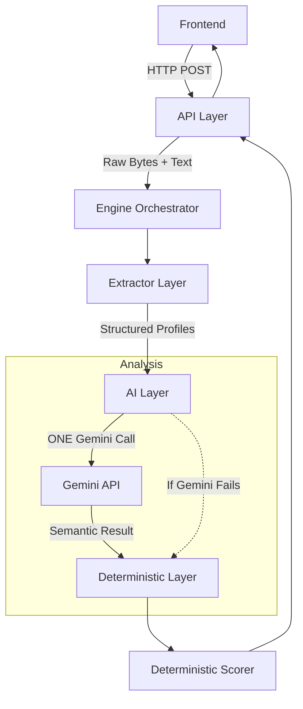

# AI Resume Screener

An AI-powered resume screening and candidate-job matching application that combines deterministic document extraction, Gemini-based semantic analysis, and deterministic scoring/fallback logic. 

The system leverages large language models strictly for semantic understanding (comparing skills and experiences) while retaining absolute control over numerical scoring through a deterministic weighting layer.

## What is this project?

The AI Resume Screener enables users to:
1. Upload a candidate resume (PDF or DOCX).
2. Paste a job description (JD).
3. Extract structured information from both inputs automatically.
4. Perform semantic candidate-job analysis using the Gemini API.
5. Compare required and preferred skills conceptually, beyond simple keyword matching.
6. Evaluate whether a candidate's experience and education meet the role's requirements.
7. Calculate a strictly deterministic match score.
8. View a detailed, readable breakdown of the score and AI analysis via a React frontend.

**Key Design Principle**: The system avoids letting an LLM directly generate a numerical match score, ensuring scoring transparency, stability, and control.

## Key Features

- **Multi-format Support**: Robust extraction for PDF (PyMuPDF with PyPDF2 fallback) and DOCX (python-docx) files.
- **Structured Parsing**: Heuristic conversion of raw resume/JD text into structured profiles.
- **Semantic AI Matching**: Gemini integration correctly identifies when a candidate has a required skill (e.g., "Photoshop" matches "Adobe Photoshop") even if the exact keyword differs.
- **Deterministic Scoring**: A transparent, weighted formula calculates the final candidate match percentage.
- **Graceful Fallback**: If Gemini fails (timeout, rate limits, no API key), the system dynamically switches to a deterministic heuristic matcher to ensure analysis can still complete.
- **One-Call Architecture**: The entire AI semantic analysis happens in exactly **one** Gemini API request.
- **CLI Observability**: Deeply instrumented backend debugging logs that trace the full lifecycle of a request with timings and stages without leaking sensitive API keys or PII.
- **Automated Test Coverage**: Extensive test suite covering AI layers, extractors, fallback mechanisms, and API routing.

*(Note: Certain advanced capabilities like bulk-resume upload, team collaboration features, and direct ATS integrations are considered Future Improvements and are not part of the current initial release.)*

## How It Works

The processing pipeline guarantees order, handles boundaries gracefully, and never mixes semantic AI logic with math.



1. **API**: Accepts the request and forwards data.
2. **Engine**: Manages the transitions between the layers and catches fatal faults.
3. **Extractor**: Analyzes file types and executes PDF/DOCX parsing into structured JSON profiles.
4. **AI Layer**: Generates the exact prompt and communicates with Gemini, parsing the result safely.
5. **Deterministic Layer**: Verifies AI results, manages the fallback trigger, and calculates the exact final score.

## Architecture

### API Layer
- **Location**: `backend/api/`
- **Responsibilities**: Fast API endpoints, request validation, and maintaining compatibility with the frontend data contracts. Includes a unified endpoint (`/api/analyze`) alongside legacy step-by-step compatibility routes.

### Engine
- **Location**: `backend/engine/`
- **Responsibilities**: Orchestrates the analysis pipeline. The Engine simply calls modules sequentially and manages errors safely. It deliberately contains no business logic.

### Extractor
- **Location**: `backend/extractor/`
- **Responsibilities**: Uses `pymupdf` (and falls back to `PyPDF2` on failure) for PDFs, and `python-docx` for Word documents. It heuristically extracts text and shapes it into categorized dictionaries.

### AI Layer
- **Location**: `backend/ai_layer/`
- **Responsibilities**: Centralized Google GenAI integration. Prepares prompts, marshals extraction data, calls the API, and normalizes Gemini outputs into safe, validated Python dictionaries.

### Deterministic Layer
- **Location**: `backend/deterministic/`
- **Responsibilities**: Where numerical math and business logic live. It runs fallback keyword-matching if the AI layer fails and governs the exact weighted percentages for the final candidate score.

## Gemini Behavior

The application executes exactly **ONE** Gemini call for a complete analysis. 

Instead of passing the resume, JD, and matching logic in disjointed steps (which balloons costs and latency), the pipeline consolidates:
`Structured Resume + Structured JD -> ONE Gemini request -> Semantic candidate-job analysis`

- **Current Configured Model**: `gemini-2.5-flash` (Defined as `GEMINI_MODEL` in `backend/ai_layer/gemini.py`).
- **Why ONE call?**: Reduces API latency significantly, prevents state mismatch between multiple LLM calls, and simplifies testing. 

## Deterministic Scoring

Gemini **never** generates the score. The `backend/deterministic/scorer.py` module computes the score using a rigid formula based on the AI layer's boolean/semantic insights.

**Weights**:
- **Required Skills**: 50%
- **Experience**: 25%
- **Education**: 15%
- **Preferred Skills**: 10%

**Logic**:
- *Required/Preferred Skills*: `(matched skills / total skills) * Weight`
- *Experience/Education*: `100% * Weight` (if requirement is met), otherwise `0%`

**Final Score** = `(Required × 0.50) + (Experience × 0.25) + (Education × 0.15) + (Preferred × 0.10)`

## Fallback System

If Gemini fails for any reason (missing `GEMINI_API_KEY`, quota limits, timeouts, or hallucinated JSON), the system does not crash.

**Fallback Flow**:
1. AI Layer encounters an error.
2. AI Layer returns a safe, standardized `error` payload.
3. The Deterministic Layer sees the AI failure and intercepts the process.
4. A deterministic heuristic (`fallback.py`) runs instead, performing exact and normalized string matching against candidate skills and simple regex for experience.
5. The Deterministic Scorer processes the fallback results natively.
6. The frontend receives a full response, flagged with `used_fallback: true`.

## Project Structure

```text
resume-scanner/
│
├── README.md
├── requirements.txt
│
├── backend/
│   ├── app.py
│   │
│   ├── api/
│   │   ├── __init__.py
│   │   └── routes.py
│   │
│   ├── engine/
│   │   ├── __init__.py
│   │   └── gate.py
│   │
│   ├── extractor/
│   │   ├── __init__.py
│   │   ├── gate.py
│   │   ├── resume_extractor.py
│   │   └── jd_extractor.py
│   │
│   ├── ai_layer/
│   │   ├── __init__.py
│   │   ├── gate.py
│   │   └── gemini.py
│   │
│   ├── deterministic/
│   │   ├── __init__.py
│   │   ├── gate.py
│   │   ├── scorer.py
│   │   └── fallback.py
│   │
│   └── observability/
│       ├── __init__.py
│       └── cli.py
│
├── frontend/
│   ├── src/
│   ├── package.json
│   └── ...
│
└── tests...
```

## Installation & Setup

### 1. Prerequisites
- Python 3.9+
- Node.js & npm (for frontend)

### 2. Environment Setup

Create a virtual environment for the backend:
```bash
python -m venv .venv
```
Activate it:
- Windows: `.\.venv\Scripts\Activate.ps1`
- Mac/Linux: `source .venv/bin/activate`

Install dependencies:
```bash
pip install -r requirements.txt
```

### 3. Configuration
Copy the example environment file in the `backend/` directory:
```bash
cp backend/.env.example backend/.env
```
Edit `backend/.env` and insert your API key:
```env
GEMINI_API_KEY=your_actual_api_key_here
CLI_DEBUG=true
```

## How to Run the Application

Start the backend (from the project root):
```bash
uvicorn backend.app:app --port 8000
```
Start the frontend (in a new terminal):
```bash
cd frontend
npm install
npm run dev
```
Open your browser to [http://localhost:5173](http://localhost:5173). Upload a resume, paste a JD, and click **Analyze**!

## Development & Debugging

### CLI Observability
The backend features a lightweight, comprehensive internal observability module (`backend/observability/cli.py`). 
When `CLI_DEBUG=true` is set in your `.env`, every analysis request prints a highly readable visual trace to the backend terminal:
```text
[REQ 9F2A] [EXTRACTOR]
→ Format: PDF
→ Primary extractor: PyMuPDF
✓ Text extracted: 4,218 characters
```
*Note: The CLI debugger guarantees it will never log your `GEMINI_API_KEY` or giant payloads of raw PII to the terminal.*

### Testing
To run the automated regression and unit test suite:
```bash
python -m unittest discover -p "test_*.py"
```

## Technology Stack
- **Frontend**: React, Vite
- **Backend**: FastAPI, Python 3.9+
- **AI**: `google-genai` Python SDK
- **Parsers**: `PyMuPDF`, `PyPDF2`, `python-docx`

## Security Considerations
- The API key is securely dynamically loaded and explicitly omitted from logging via `backend/observability`.
- User uploaded files (`UploadFile`) are processed completely in memory (via `io.BytesIO`) and are never written to disk, ensuring data hygiene and stateless request termination.

## Current Limitations & Future Improvements
- **Rate Limiting**: Currently unhandled outside of the AI fallback trigger. Production deployments will need API-gateway level rate limiting.
- **Multilingual Support**: The heuristic fallback logic and regex parsers are heavily tuned for English resumes.
- **Batch Processing**: The current API is designed for single-file, synchronous upload flows. Future improvements will incorporate background task workers (e.g., Celery/Redis) for bulk batch processing.
